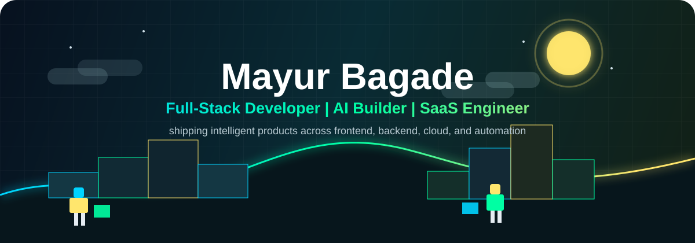
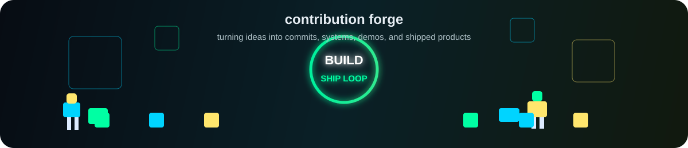
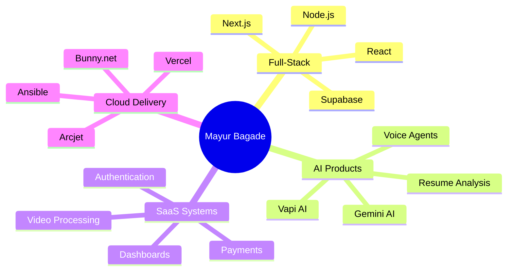
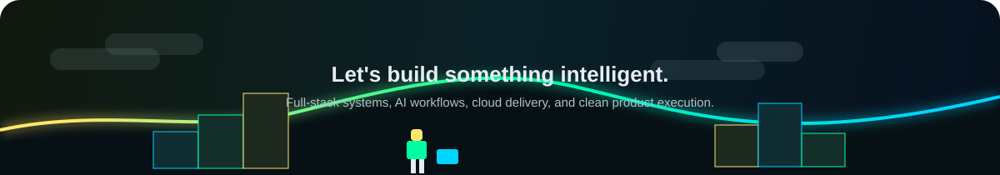

<div align="center">




### Building full-stack products with AI, cloud, and modern web craft

I create polished web platforms that connect beautiful frontends, reliable backend systems, intelligent AI workflows, and production-ready cloud tooling.

<p>
	<a href="https://github.com/mayurbagade456?tab=repositories">
		
	</a>
	<a href="https://www.linkedin.com/in/mayurbagade456">
		
	</a>
	<a href="mailto:mayurbagade456@gmail.com">
		
	</a>
</p>


</div>

---

## About Me

```ts
const mayur = {
	role: "Full-Stack Developer",
	focus: ["AI integrations", "SaaS products", "Cloud-ready web apps"],
	frontend: ["React", "Next.js", "TypeScript", "TailwindCSS", "GSAP"],
	backend: ["Node.js", "Python", "Supabase", "Mongoose", "Stripe"],
	currentlyBuilding: "AI-powered full-stack experiences",
	mindset: "Ship useful products with clean UX and solid engineering"
};
```

- Full-stack web development with modern frontend and backend architecture
- AI/ML integrations using tools like Vapi AI, Gemini AI, and custom evaluation flows
- Cloud-first product delivery with Vercel, Bunny.net, Arcjet, and automation tools
- Practical SaaS systems including authentication, payments, video processing, and dashboards

---

## Tech Stack

<div align="center">

### Frontend


### Backend


### AI, Cloud & Product Systems


</div>

---

## Featured Builds

<div align="center">


</div>

<table>
	<tr>
		<td width="50%">
			<h3>AI Mock Interview Platform</h3>
			<p>Voice-led interview practice with structured AI feedback.</p>
			<p><b>Stack:</b> Next.js, TypeScript, Vapi AI</p>
			<ul>
				<li>Conversational mock interviews</li>
				<li>Role-specific question flows</li>
				<li>AI-generated feedback summaries</li>
			</ul>
		</td>
		<td width="50%">
			<h3>AI-Powered Resume Analyzer</h3>
			<p>Resume evaluation experience with practical improvement signals.</p>
			<p><b>Stack:</b> React, AI evaluations</p>
			<ul>
				<li>Resume scoring and analysis</li>
				<li>Keyword and role-fit insights</li>
				<li>Actionable recommendations</li>
			</ul>
		</td>
	</tr>
	<tr>
		<td width="50%">
			<h3>Loom Clone</h3>
			<p>Full-stack video sharing platform for recording and hosting content.</p>
			<p><b>Stack:</b> Next.js, Bunny.net, full-stack video</p>
			<ul>
				<li>Video upload and processing</li>
				<li>Shareable playback pages</li>
				<li>Cloud media delivery</li>
			</ul>
		</td>
		<td width="50%">
			<h3>Evently</h3>
			<p>Event management platform with booking, auth, and payments.</p>
			<p><b>Stack:</b> Next.js, Stripe, Clerk</p>
			<ul>
				<li>Event creation and discovery</li>
				<li>Secure user authentication</li>
				<li>Stripe payment workflows</li>
			</ul>
		</td>
	</tr>
	<tr>
		<td width="50%">
			<h3>Converso</h3>
			<p>LMS SaaS concept powered by Supabase and AI voice interactions.</p>
			<p><b>Stack:</b> Next.js, Supabase, Vapi AI</p>
			<ul>
				<li>Learning session workflows</li>
				<li>Voice agent experiences</li>
				<li>Database-backed SaaS state</li>
			</ul>
		</td>
		<td width="50%">
			<h3>Carepulse</h3>
			<p>Healthcare platform for appointment scheduling and patient workflows.</p>
			<p><b>Stack:</b> TypeScript, scheduling, healthcare UX</p>
			<ul>
				<li>Appointment booking flows</li>
				<li>Admin-friendly schedules</li>
				<li>Reliable form handling</li>
			</ul>
		</td>
	</tr>
	<tr>
		<td width="50%">
			<h3>Roomify</h3>
			<p>AI architectural visualization from 2D concepts to 3D previews.</p>
			<p><b>Stack:</b> React, AI, 2D-to-3D rendering</p>
			<ul>
				<li>Room concept visualization</li>
				<li>AI-assisted rendering pipeline</li>
				<li>Interactive design previews</li>
			</ul>
		</td>
		<td width="50%">
			<h3>Tourvisto</h3>
			<p>Travel dashboard enhanced with Gemini AI recommendations.</p>
			<p><b>Stack:</b> React Router v7, Gemini AI</p>
			<ul>
				<li>AI travel recommendations</li>
				<li>Dashboard-first UX</li>
				<li>Modern routing architecture</li>
			</ul>
		</td>
	</tr>
</table>

<div align="center">

<a href="https://github.com/mayurbagade456?tab=repositories">
	
</a>

</div>

---

## GitHub Snapshot

<div align="center">


<br />


<br />
<br />


<br />
<br />


<br />
<br />


<br />
<br />



</div>

---

## Current Focus

<div align="center">


</div>



---

## Let's Connect

<div align="center">

I am interested in full-stack products, AI-enabled workflows, SaaS platforms, and clean developer-friendly systems.

<br />
<br />

<a href="https://github.com/mayurbagade456">
	
</a>
<a href="https://www.linkedin.com/in/mayurbagade456">
	
</a>
<a href="mailto:mayurbagade456@gmail.com">
	
</a>

<br />
<br />



</div>
